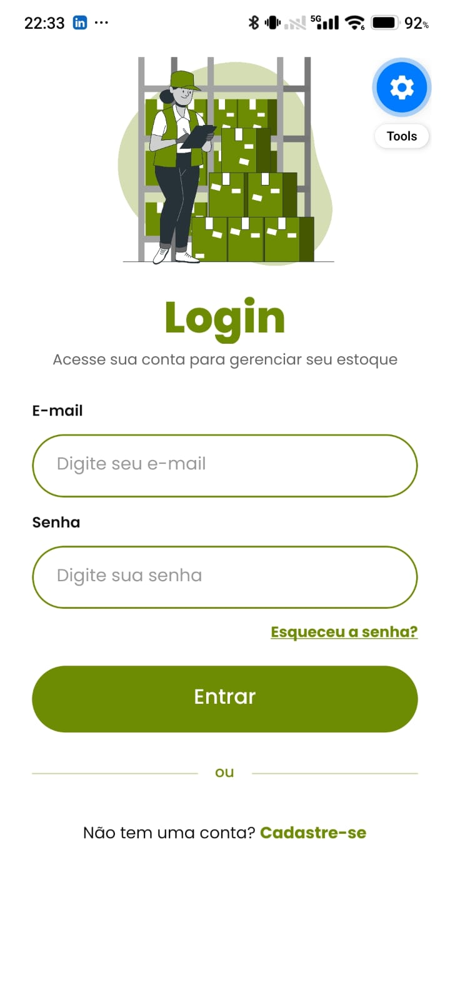
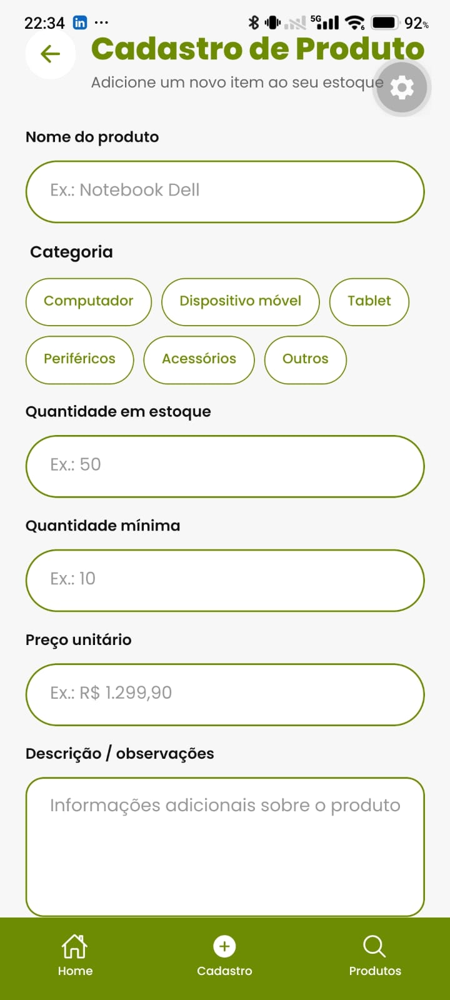

# Estoque Fácil

## Descrição
Aplicativo mobile para gerenciamento inteligente de estoque voltado a
pequenos e médios comerciantes, permitindo cadastrar, buscar e localizar
produtos fisicamente no estoque (rua, coluna, vão e nível) com o auxílio da
câmera do celular para leitura de código de barras.

## Problema que a aplicação resolve
Pequenos e médios comércios muitas vezes não têm controle preciso sobre a
quantidade e a localização dos produtos em estoque, o que gera perda de
tempo na busca de itens e falta de visibilidade para o lojista.

## Tecnologias utilizadas
- **Mobile:** React Native (Expo) + TypeScript
- **Navegação:** Expo Router (rotas em arquivo + tabs inferiores)
- **Tipografia:** Poppins
- **Backend:** Spring Boot *(ainda não implementado)*
- **Banco de dados:** PostgreSQL (relacional) *(ainda não implementado)*
- **Persistência local (prevista):** SQLite / AsyncStorage *(ainda não implementado)*

## Capturas de tela

| Login | Cadastro de Produto |
|---|---|
|  |  |

> Salve as imagens da Etapa 2 em `docs/screenshots/` com esses nomes (ou ajuste os caminhos acima) para as imagens aparecerem no README.

## Instruções para execução

O backend ainda não foi implementado; por enquanto só o frontend (mobile) pode ser executado.

```bash
cd src/frontend/EstoqueFacil
npm install
npx expo start
```

Com o Expo em execução, é possível abrir a aplicação:
- no **Expo Go**, escaneando o QR code em um dispositivo Android;
- em um **emulador Android**, pressionando `a` no terminal;
- no **navegador**, pressionando `w` no terminal (quando suportado).

Caso ocorram problemas após alterações nos arquivos, reinicie limpando o cache:

```bash
npx expo start -c
```

## Funcionalidades implementadas

- [x] Login — interface implementada (e-mail, senha, "esqueceu a senha?", cadastro); **sem autenticação real ainda**
- [x] Dashboard — visão geral do estoque (itens cadastrados, itens abaixo do mínimo, valor total, gráfico por categoria), com dados mockados
- [x] Cadastro de produto — interface implementada (nome, categoria, quantidade, quantidade mínima, preço, descrição); **apenas cadastro manual — leitura de código de barras ainda não implementada**
- [x] Listagem/busca de produtos — interface implementada com dados mockados
- [ ] Endereçamento físico do produto (rua, coluna, vão, nível) — ainda não implementado nas telas
- [ ] Leitura de código de barras via câmera — ainda não implementada
- [ ] Persistência de dados e integração com backend — prevista para as próximas etapas

## Limitações conhecidas
- Etapa 01: apenas planejamento e documentação da proposta, sem código
  funcional ainda.
- Etapa 02: implementada a camada visual e de navegação (Login, Dashboard,
  Cadastro de Produto e Consulta de Produtos), com dados mockados. Ainda não
  há persistência de dados, autenticação real, comunicação com backend,
  leitura de código de barras nem os campos de endereçamento físico do
  produto (rua, coluna, vão, nível) previstos na proposta original.

## Documentação
- [Proposta da aplicação](docs/proposta.md)
- [Etapa 02 — Implementação do protótipo de interface](docs/etapa-02.md)