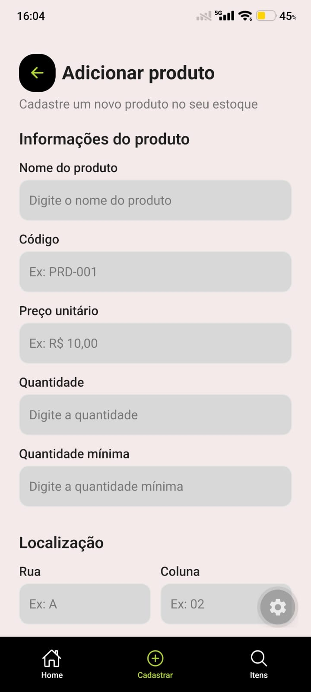

# Estoque Fácil

## Descrição
Aplicativo mobile para gerenciamento inteligente de estoque voltado a
pequenos e médios comerciantes, permitindo cadastrar, buscar e localizar
produtos fisicamente no estoque (rua, coluna, vão e nível) com o auxílio da
câmera do celular para leitura de código de barras.

## Problema que a aplicação resolve
Pequenos e médios comércios muitas vezes não têm controle preciso sobre a
quantidade e a localização dos produtos em estoque, o que gera perda de
tempo na busca de itens e falta de visibilidade para o lojista.

## Tecnologias utilizadas
- **Mobile:** React Native (Expo) + TypeScript
- **Navegação:** Expo Router (rotas baseadas em arquivos, `Stack` + `Tabs` inferiores)
- **Tipografia:** Poppins
- **Backend:** Spring Boot *(ainda não implementado)*
- **Banco de dados:** PostgreSQL (relacional) *(ainda não implementado)*
- **Persistência local (prevista):** SQLite / AsyncStorage *(ainda não implementado)*

## Navegação

A navegação é feita com o Expo Router. O `Stack` principal direciona o
usuário para a tela de Login e, após o acesso, para o grupo de abas inferiores.

```text
src/app/
├── _layout.tsx        # Stack principal
├── index.tsx          # Redireciona para o Login
├── login.tsx
└── (tabs)/
    ├── _layout.tsx    # Barra de navegação inferior (Tabs)
    ├── index.tsx      # Home / Dashboard
    ├── search.tsx     # Itens / Busca
    └── add.tsx        # Cadastrar produto
```

```text
Aplicação → Login → Área principal ┬─ Home
                                   ├─ Itens
                                   └─ Cadastrar
```

| Aba       | Função                         |
| --------- | ------------------------------ |
| Home      | Visualizar o resumo do estoque |
| Itens     | Buscar e consultar produtos    |
| Cadastrar | Cadastrar um novo produto      |

> Na Etapa 03, a aba **Menu** foi removida por não possuir funcionalidades
> suficientes que justificassem uma área própria. Ela poderá ser
> reintroduzida caso sejam implementadas configurações, perfil ou outras
> opções administrativas.

## UX e acessibilidade

**Feedback visual**
- Botões: estados normal, pressionado, desabilitado e carregamento (quando aplicável)
- Campos de entrada: estados normal, focado, erro (com mensagem textual) e desabilitado
- Filtros: estados normal, pressionado e selecionado

**Componentes reutilizáveis:** `PrimaryButton`, `InputField`, `FilterButton`,
`SearchInput`, `BackButton` e `ProductListItem`, garantindo comportamento e
aparência consistentes entre as telas.

**Acessibilidade**
- `accessibilityRole`, `accessibilityLabel` e `accessibilityState` nos botões, campos e filtros
- Campos com label, indicação de estado desabilitado e identificação de erro
- `BackButton` com identificação específica para leitores de tela
- Informações importantes não dependem apenas de cor (uso de mensagens textuais)
- Tipografia e espaçamentos centralizados no sistema de tema da aplicação
- Áreas de toque dimensionadas para uso em dispositivos móveis

## Capturas de tela

| Login | Cadastro de Produto |
|---|---|
|  |  |

> Salve as imagens da Etapa 2 em `docs/screenshots/` com esses nomes (ou ajuste os caminhos acima) para as imagens aparecerem no README.

## Instruções para execução

O backend ainda não foi implementado; por enquanto só o frontend (mobile) pode ser executado.

```bash
cd src/frontend/EstoqueFacil
npm install
npx expo start
```

Com o Expo em execução, é possível abrir a aplicação:
- no **Expo Go**, escaneando o QR code em um dispositivo Android;
- em um **emulador Android**, pressionando `a` no terminal;
- no **navegador**, pressionando `w` no terminal (quando suportado).

Caso ocorram problemas após alterações nos arquivos, reinicie limpando o cache:

```bash
npx expo start -c
```

### Testando a navegação e a acessibilidade

1. Inicie a aplicação e verifique o direcionamento para a tela de Login.
2. Preencha e-mail e senha e pressione o botão de Login (fluxo de demonstração).
3. Confirme o acesso à Home e navegue pelas abas **Itens** e **Cadastrar**.
4. Na aba Itens, utilize o campo de busca e os filtros.
5. Na aba Cadastrar, teste os campos de entrada e seus estados visuais.
6. Ative o leitor de tela do dispositivo (no Android, o **TalkBack**) e verifique
   se os elementos interativos possuem identificação e descrição adequadas.

## Funcionalidades implementadas

- [x] Login — interface implementada (e-mail, senha, "esqueceu a senha?", cadastro); **sem autenticação real ainda**
- [x] Dashboard (Home) — visão geral do estoque (itens cadastrados, itens com estoque baixo, valor total, gráfico por categoria e seção de produtos), com dados mockados
- [x] Cadastro de produto — interface implementada (informações do produto, localização, imagem e ação de cadastro); **apenas cadastro manual, sem persistência — leitura de código de barras ainda não implementada**
- [x] Listagem/busca de produtos — interface implementada com campo de busca, filtros e lista com código e quantidade em estoque, com dados mockados
- [x] Navegação por abas (Home, Itens, Cadastrar) com fluxo Login → área principal
- [x] Feedback visual nos principais componentes (botões, campos de entrada e filtros)
- [x] Medidas iniciais de acessibilidade (papéis, rótulos e estados para leitores de tela)
- [ ] Endereçamento físico do produto (rua, coluna, vão, nível) — ainda não implementado de forma completa nas telas
- [ ] Leitura de código de barras via câmera — ainda não implementada
- [ ] Persistência de dados e integração com backend — prevista para as próximas etapas

## Limitações conhecidas
- Etapa 01: apenas planejamento e documentação da proposta, sem código
  funcional ainda.
- Etapa 02: implementada a camada visual e de navegação (Login, Dashboard,
  Cadastro de Produto e Consulta de Produtos), com dados mockados. Ainda não
  há persistência de dados, autenticação real, comunicação com backend,
  leitura de código de barras nem os campos de endereçamento físico do
  produto (rua, coluna, vão, nível) previstos na proposta original.
- Etapa 03: navegação refinada, com feedback visual e acessibilidade nos
  principais componentes. O fluxo de Login continua sendo apenas de
  demonstração (sem autenticação com backend), os dados seguem estáticos
  (sem PostgreSQL ou API) e não há funcionalidades avançadas de gerenciamento
  de conta que justifiquem um Menu próprio.

## Documentação
- [Proposta da aplicação](docs/proposta.md)
- [Etapa 02 — Implementação do protótipo de interface](docs/etapa-02.md)
- [Etapa 03 — Navegação, UX e Acessibilidade](docs/etapa-03.md)